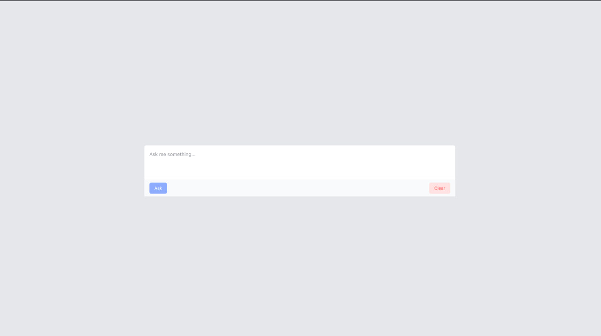
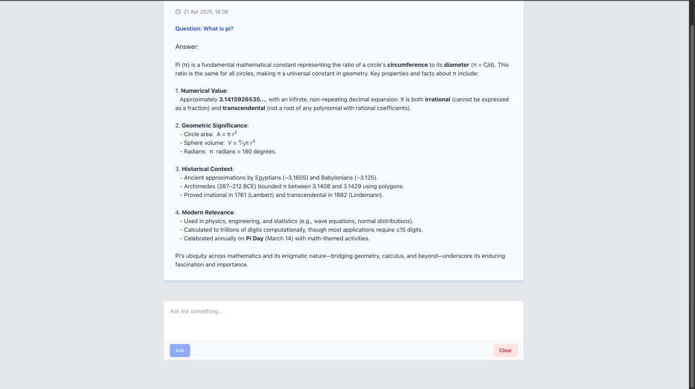

# DevHelper – AI-Powered Developer Assistant

DevHelper is a full-stack AI assistant that helps developers get instant answers to technical questions using FastAPI, Redis, and a modern Next.js frontend. It stores session-based history, formats Markdown-style answers, and offers a clean, responsive UI.




---
## Live demo
- Frontend : `https://dev-helper-gakz.vercel.app/`
- Backend : `https://stickshift.ke/docs`

---
## Tech Stack

- Backend: FastAPI (Python)
- Frontend: Next.js (TypeScript, React)
- LLM Integration: Deepseek running on NVIDIA / OpenAI compatible APIs
- Redis: For storing query history per session
- Docker & Docker Compose: Easy development & deployment

---

## Prerequisites

- Docker & Docker Compose installed

---

## Step 1: Configure Environment Variables

Create the following environment variable files:

backend/.env.docker

```env
OPENAI_API_KEY=your-nvidia-or-openai-key
OPENAI_API_BASE=https://integrate.api.nvidia.com/v1
OPENAI_MODEL_NAME=deepseek-ai/deepseek-r1

REDIS_HOST=redis
REDIS_PORT=6379
```

frontend/.env.local

```env
NEXT_PUBLIC_API_BASE_URL=http://localhost:8000/api
```

Make sure the backend uses redis as the host, since that’s the internal Docker hostname.

## Step 2: Step 2: Run with Docker Compose

```bash
docker-compose up -d --build
```
This command will build and start both the backend and frontend services.

-	Start Redis on port 6379
-	Start FastAPI backend on http://localhost:8000
-	Start FastAPI swagger page on http://localhost:8000/docs
-	Start Next.js frontend on http://localhost:3000

## Application Features
Ask questions in plain English e.g.:
```
What is pi?
```
```
What documents do I need to travel from Kenya to Ireland?
```
```
How do I create a Docker image?
```
-	Responses are formatted:
-	Lines starting with ### are converted to 🔹 bullet emoji
-	… tags from the LLM are removed
-	Chat history stored per session in Redis
-	“Clear history” button with SweetAlert confirmation
-	Validation for empty input on frontend & backend
-	Responsive UI with fixed input bar and auto-scroll
-	Mobile responsive design
